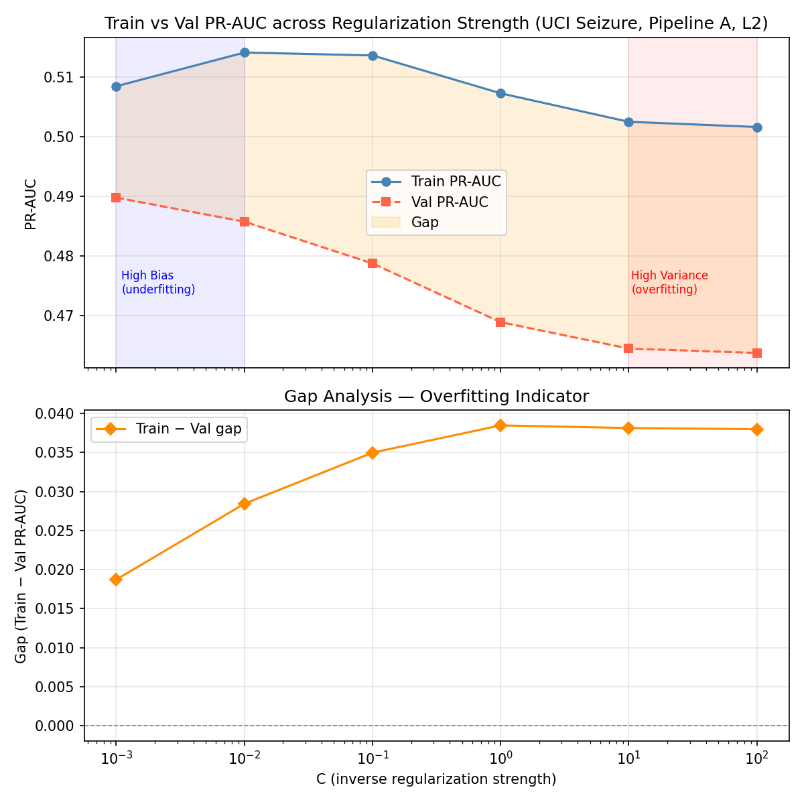
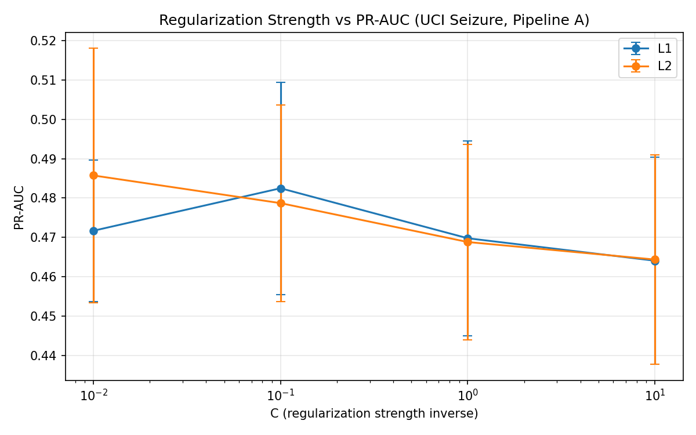
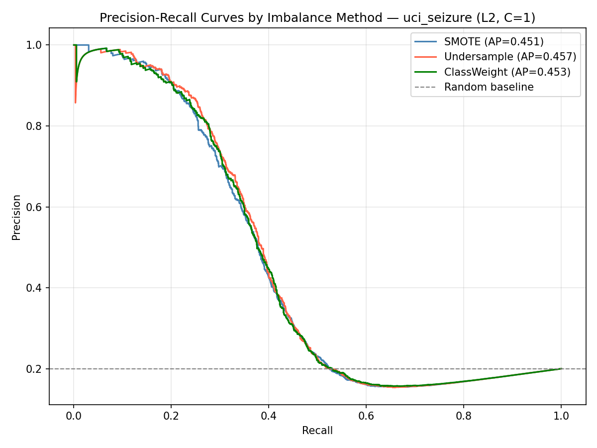
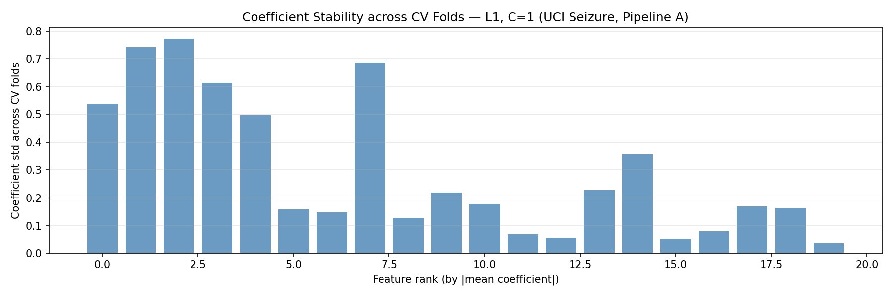

# EEG-Based State Classification
## Preprocessing, Regularization & Generalization Study

<p>
  
  
  
  
  
</p>

**Author:** Sadiq Mansoor · **Course:** Machine Learning Theory — Semester 8 · **Type:** Major research assignment

📄 Formal write-up: [`docs/IEEE_Format_documentation.pdf`](docs/IEEE_Format_documentation.pdf) · 🔁 Reproduce everything: `python run_all.py`

---

## Research Question

> *How do preprocessing choices and regularization jointly affect generalization in imbalanced EEG classification tasks?*

## Headline Findings

- **Polynomial feature expansion significantly increased overfitting** — hypothesis H5 **rejected** at *p* = 1e-6.
- **Best generalization** came from **Pipeline A (scaling → mutual-information selection) + L2 (C = 1.0)** — a dense, balanced-bias-variance model beat sparser and more complex alternatives.
- Results are grounded in the **bias–variance decomposition** and validated on a held-out test set never seen during training.

| Dataset | Holdout PR-AUC | Holdout F1 |
|---------|:-------------:|:----------:|
| Bonn EEG | **0.811** | 0.618 |
| EEG Eye State | 0.593 | 0.442 |
| UCI Seizure | 0.452 | 0.022 |

---

## Selected Figures

<p align="center">
  
  
</p>
<p align="center">
  
  
</p>
<p align="center"><em>Left→right: bias–variance gap vs C · regularization vs PR-AUC · PR curves under imbalance · L1 coefficient stability. All 19 figures live in <code>results/figures/</code>.</em></p>

---

## Datasets

| Dataset | Samples | Features | Imbalance | Source |
|---------|---------|----------|-----------|--------|
| UCI Epileptic Seizure Recognition | 11,500 | 178 | 1:4 (seizure minority) | UCI ML Repository |
| Bonn University EEG | 500 | 4,097 (raw) / 6 (features) | Mild | University of Bonn, Dept. of Epileptology |
| UCI EEG Eye State | 14,980 | 14 | ~45:55 | UCI ML Repository |

> Datasets are auto-downloaded by `src/data_loader.py` on first run — nothing to fetch manually.

---

## How to Run

```bash
pip install -r requirements.txt
python run_all.py            # runs all 7 sections end-to-end (~25–30 min on a laptop)
```

This single command regenerates **every table and figure** in `results/`. Random seeds are fixed in
`src/utils.py`, so runs are reproducible.

---

## Preprocessing Pipelines

| Pipeline | Steps | Datasets |
|----------|-------|---------|
| A | StandardScaler → Mutual-Information feature selection (top-k) | All |
| B | StandardScaler → PCA (95% variance) | All |
| C | Wavelet denoising (db4) → StandardScaler → PCA | Bonn EEG only |

---

## Research Hypotheses

| # | Hypothesis | Result |
|---|-----------|--------|
| H1 | Preprocessing order has no effect on PR-AUC | `results/tables/h1_pipeline_ttest.csv` |
| H2 | L1 / L2 / ElasticNet generalize equivalently | `results/tables/h2_regularization_ttest.csv` |
| H3 | ElasticNet does not differ from pure L1/L2 | `results/tables/h3_elasticnet_ttest.csv` |
| H4 | Imbalance technique does not interact with regularization | `results/tables/h4_imbalance_ttest.csv` |
| H5 | Polynomial features do not cause overfitting | **Rejected — p = 1e-6** |

---

## Project Structure

```
run_all.py               ← Master script — runs all experiments end-to-end
implementation_plan.md   ← Full research design and methodology
docs/                    ← IEEE-format write-up (PDF)
src/
  ├── data_loader.py       ← Dataset loading with auto-download
  ├── preprocessing.py     ← Pipelines A, B, C
  ├── models.py            ← Logistic-regression variants
  ├── evaluation.py        ← Metrics, cross-validation, plots
  ├── imbalance.py         ← SMOTE, undersampling, class weighting
  ├── comparative_analysis.py ← Tables and hypothesis tests
  └── utils.py             ← Timer, logger, fixed random state
notebooks/               ← 01–07 sectioned analysis + Master_Analysis.ipynb
results/
  ├── figures/             ← 19 generated plots
  └── tables/              ← 10 result CSVs
```

---

## Theoretical Framework

All experiments are grounded in the bias–variance decomposition:

```
Total Error = Bias² + Variance + Irreducible Noise
```

- **Strong regularization (small C)** → high bias, low variance → underfitting
- **No regularization + polynomial features** → low bias, high variance → overfitting
- **L1** → sparse, higher bias, lower variance · **L2** → dense, balanced · **ElasticNet** → combines both
- **SMOTE** → reduces minority-class bias, may raise variance

---

## Dependencies

`scikit-learn ≥ 1.3` · `imbalanced-learn ≥ 0.11` · `numpy ≥ 1.24` · `pandas ≥ 2.0` ·
`matplotlib ≥ 3.7` · `seaborn ≥ 0.12` · `scipy ≥ 1.10` · `pywt ≥ 1.4` · `jupyter ≥ 1.0`
